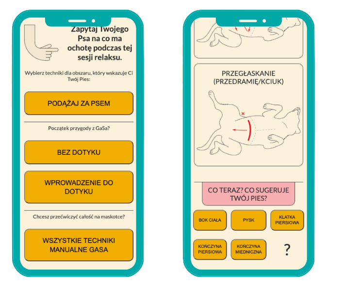

# GaSa App for DOG LOVERS


### Table of content

- [Description](#description)
- [How To Use](#how-to-use)
- [About Author](#about-author)

## Description

- React web application for dog 🐶 owners who would like to massage their pets with GaSa technique.
- GaSa present a unique approach to animal relaxation massage - for creating a relaxing ritual that suits you and your dog best.
- Dog lovers learn the ways to stroke their pet. But there is not the only one valid way to perform them. Application allows to choose technique.
- We start a GaSa massage at a point that is comfortable for our pet. ❤️ If they don’t like to be touched, we start from... "non-touching".

### About project

- Application optimized for mobile view. 📲



### Technologies

- JavaScript / React
- CSS / SCSS

This project was bootstrapped with [Create React App](https://github.com/facebook/create-react-app).
In the project directory, you can run the app in the development mode.

```
npm start
```

### What toolset did I use and learn in this project?

- Redux / @reduxjs/toolkit
- React Router
- GitHub Pages / gh-pages

### Work In Progress

It is still "work in progress", I still have some issues and challenges, but I will handle it. 💪

I deploy first version "GaSa App" and keep in mind that I would like make fixes and improvements in next versions.

Improvments to make after first deploy on gh-pages (gasa-web-app@0.1.0 deploy):

- [ ] Improve, fix issues and add audio functionality and pdf viewer
- [ ] Add tests
- [ ] Add menu bar
- [ ] Add settings view
- [ ] Add real login option
- [ ] Make english version of application

## How To Use

- Clone the project and run `npm start`
- Go to [GitHub Page - version 0.1.0](https://martakmb.github.io/gasa-web-app/) and login with random name and e-mail, password: `gasa2023demo`
- `TODO` When application will be ready I will deploy it on my server. 🚧

## About Author

Hello! 👋
I am Marta, front-end developer and creator of GaSa technique.

- [My LinkedIn](https://www.linkedin.com/in/m-mucha-balcerek/)
- 🇵🇱 [GaSa Website](https://gasa.martamucha.pl/)
